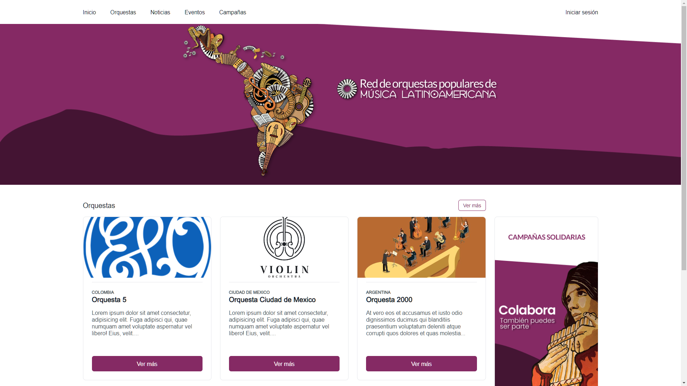
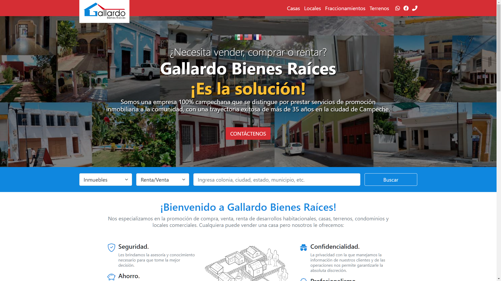
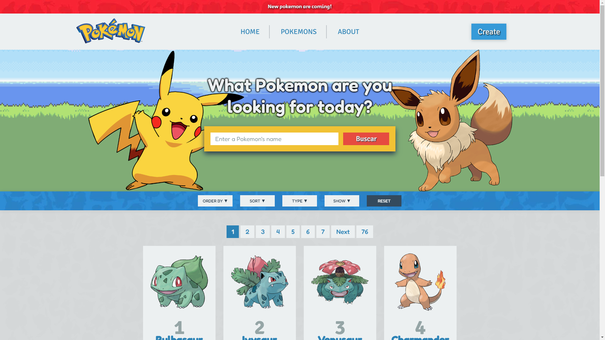

# ¡Hola!👋 Soy Oscar Cu | Full Stack Developer

## ¿Quién soy?

Full Stack Developer con especialidad en Front-End. Experiencia trabajando con NodeJS, React, Redux, NextJS, Styled-Components, Sequelize, Prisma, Express, SQL, SCRUM entre otros. Durante más de 20 años me he dedicado al desarrollo de proyectos para micro, pequeñas y medianas empresas de mi localidad, diseñando, desarrollando, hospedando y administrando sus páginas y sitios web.

Escríbeme a: oscaracu@miplazaweb.com.mx | Mándame un WhatsApp: +52 (981) 818 7885

 

## Tech Skills

  
  
  
  
  
  
  
  
  
  
  
  
  
  
  
  
  
  
  
  
  
  
  
  
  
  
  
  
  
  
  
  

 

## Proyectos Recientes

<table><tr><td valign="top" width="50%">

### Red de Orquestas Populares

[https://github.com/oscaracu/PFHenry-MyOrchestra ](https://github.com/oscaracu/PFHenry-MyOrchestra)

### Gallardo Bienes Raíces

[https://github.com/oscaracu/gallardobienesraices](https://github.com/oscaracu/gallardobienesraices)

</td><td valign="top" width="50%">

### Pokemon App

[https://github.com/oscaracu/PI-Pokemon](https://github.com/oscaracu/PI-Pokemon)

</td></tr></table>

 

## Github Stats

<table><tr><td valign="top" width="50%">

</td><td valign="top" width="50%">

</td></tr></table>
 
